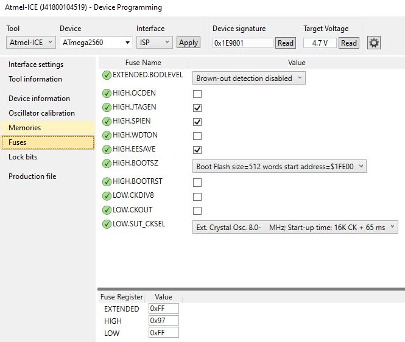
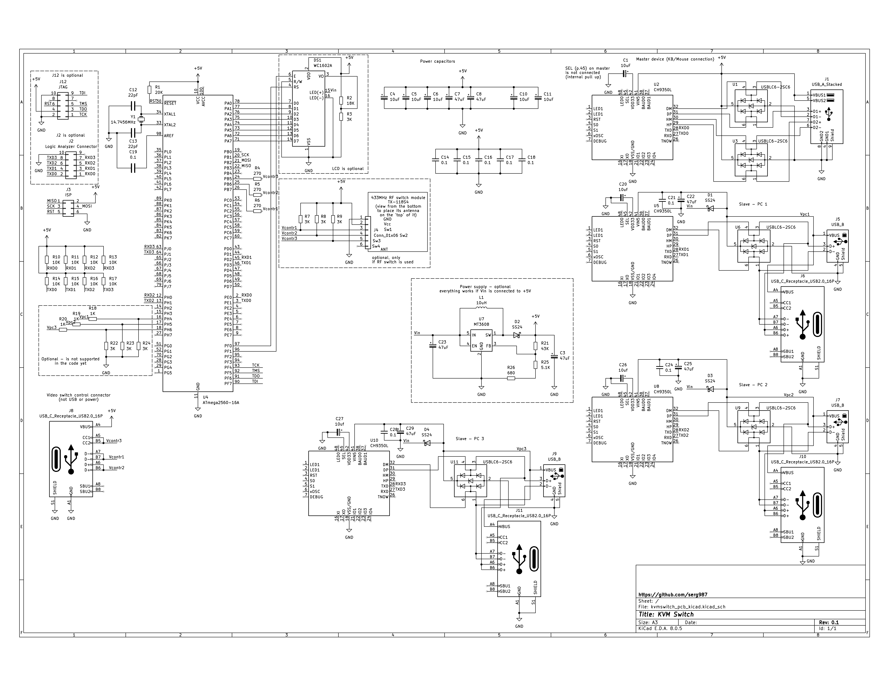
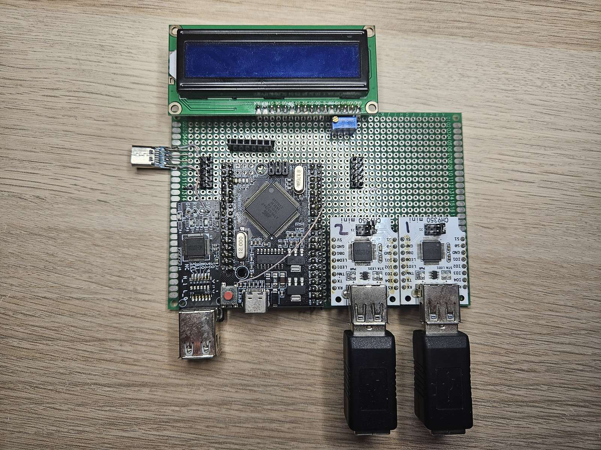
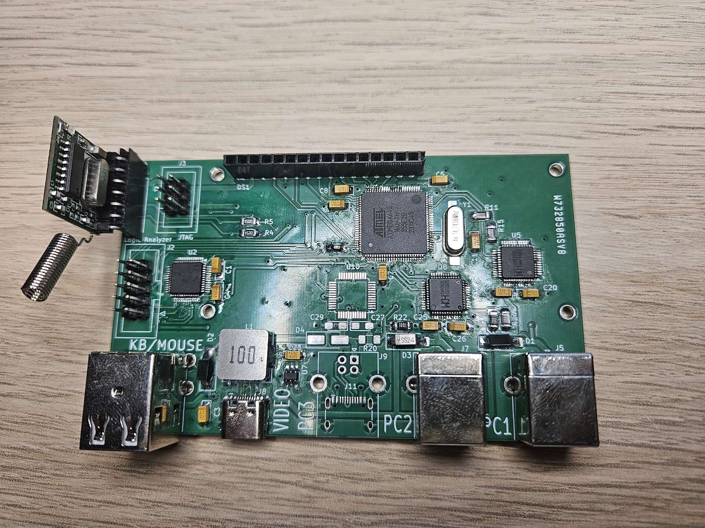
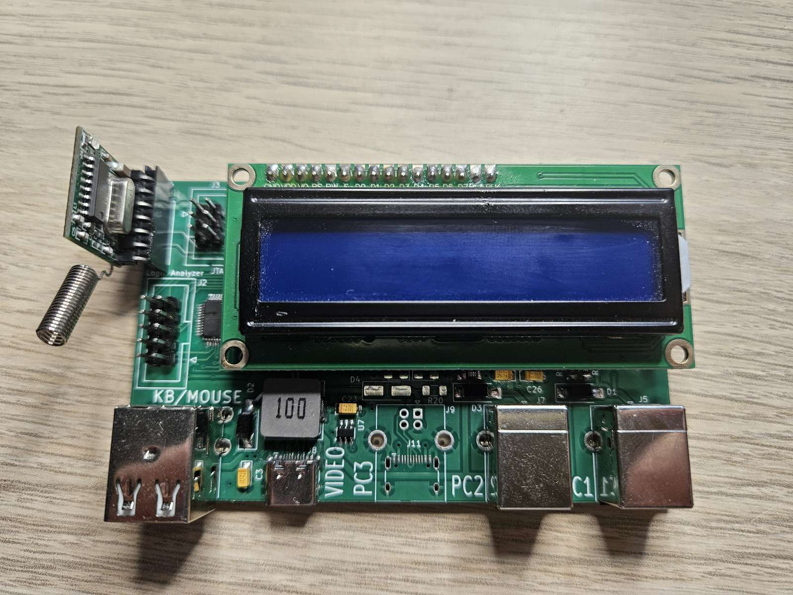

# KVMego KVM Switch

## Why?

The market for KVM switches is quite wide, but it is difficult to find one that properly fits someone's needs. The main disadvantage is that they are manufactured as single units, where video and keyboard/mouse switches are housed in the same enclosure. This not only forces users to deal with numerous thick cables but also limits their options. Some switches may have EDID support but lack hotkey support, while others may not have enough display ports or support for needed resolutions. However, the main problem is that most switches implement just an ordinary USB switch that disconnects displays, keyboards, and mice from inactive computers, making it possible to detect when the switch is being used. Additionally, KVM switches usually do not support a mouse jiggler function, which allows inactive computers to stay awake while not in use.

This project attempts to resolve most of these issues.

## Description

### Main Features:
- **Modular architecture**: The keyboard/mouse control unit is separated from video switches, allowing users to either use existing switches or create custom video switches. A video switch may be directly plugged into a monitor, requiring fewer thick video cables.
- **Persistent USB connection**: Once the KVM switch is connected to a computer's USB port, it is never disconnected, making it impossible to detect switching by disconnection.
- **Integrated controls**: All controls and indicators are built into the keyboard; no separate buttons or LEDs are needed. The unit can be hidden from view.
- **Built-in mouse jiggler**: Keeps computers awake, both active and inactive ones.
- **Cost-effective components**: Uses development modules that require no high-precision soldering.
- **Plain C ATMega code**: No USB stack required, easily adaptable to individual needs.

### Known Limitations:
- **USB wire connections**: The unit connects to computers via USB wires. Not many keyboard and mouse types have been tested, but it has worked with all tested devices, including wireless mice with 2.4GHz USB dongle.
- **USB-only switching**: Only USB keyboards and mice can be switched between computers. However, with an external USB switch and some adaptation, other devices may be connected.
- **No VID/PID copying**: A computer will see a standard HID device with the CH9350L signature rather than the original device signature.
- **Processing delays**: USB-UART-CPU-UART-USB processing introduces delays up to several dozen milliseconds, though this is not noticeable during normal use.
- **Video switch requirement**: Still requires video switches. Existing switches must be adapted to use plain on/off signals or require code adaptation. RF-controlled custom video switches are supported via RF transmitter code.
- **Three-computer limit**: Currently supports up to 3 computers.
- **HID packet structure dependency**: Different HID devices have varying UART packet structures, which is critical for the jiggler function. Currently, 4 types of mouse packets are recognized, so the jiggler may not work with some mice, though main switch functionality should remain unaffected.
- **No hot-plugging**: Due to different mouse types, mice cannot be hot-plugged as the jiggler may stop working. The switch must be fully disconnected from all computers to change the mouse.

## Compiling and programming

The project uses Microchip Studio as the IDE, so all settings are configured there. By default, it targets the ATMega2560 with the 'DEBUG' configuration, which produces slightly larger code. If debugging is not needed, switch to the 'Release' target for optimized builds.

Fuses for ATMega:

### Build Configuration Options:

#### LCD_DEBUG
When `LCD_DEBUG` is defined in `src/common/config.h`, the system enables debug information output to a 1602 LCD display. This feature:
- Displays error messages and system status information
- Shows various error codes including:
  - `E: UnknCmdM XX` - Unknown command byte from master (XX = hex value)
  - `E: UnknCmdS X XX` - Unknown command byte from slave (X = channel, XX = hex value)
  - `E: KbMsDaSzEx XX` - Keyboard/Mouse data size exceeded (XX = size)
  - `E: VPSizeEx XX` - VID/PID data size exceeded (XX = size)
  - `E: QueueOvrflw` - Scheduler queue overflow
- When LCD is not going to be used, comment out `#define LCD_DEBUG` in config.h

#### RF_TRANSMITTER
When `RF_TRANSMITTER` is defined in `src/common/config.h`, the video control lines become active (low level) for 2 seconds only during
the switching. This allow to contol the 433MHz RF encoded transmitter with 4 buttons:
- See `videoSwitchControl.c` for implementation details
- For simple continuous high-level video control signals, comment out `#define RF_TRANSMITTER` in config.h

## User Manual

### Initial Setup
Always connect the device to a PC with the operating system turned on, logged in, and not in sleep mode. There have been reported issues with macOS (likely hardware-related and possibly connected to power management) where the CH9350L fails to initialize. See the Known Issues section for details.

### LCD Display Messages
If an LCD is connected and `LCD_DEBUG` is enabled, you will see various status and error messages:

**System Status Messages:**
- Normal operation displays current PC connection status
- Error messages appear when issues occur (see LCD_DEBUG section above)
- Messages alternate between lines to show multiple pieces of information

**Error Indicators:**
- Errors are displayed with prefixes like "E: " followed by specific error codes
- Unknown command errors show the problematic byte value in hexadecimal
- Size exceeded errors indicate buffer overflows
- Queue overflow indicates the scheduler is overloaded

### Single PC Usage
The device can be used with a single PC if only the jiggler functionality is needed without additional device connections.

### Control Interface
Everything is controlled by double-pressing the 'ScrollLock' button, which starts the control sequence.

#### Control Sequence:
1. **Initiate control mode**: Double-press 'ScrollLock'
2. **Visual feedback**: All three keyboard LEDs will blink once
3. **Current state display**: LEDs will blink to show the current switching mode state (e.g., if current PC is 2, the CapsLock LED will blink)
4. **Command input**: You can proceed with a command without waiting for the blinking to stop
5. **New state confirmation**: After state change, LEDs will blink to show the new state
6. **Error indication**: If there's an error (requested PC not connected or unsupported control button), all 3 LEDs will blink rapidly
7. **Auto-exit**: The device automatically exits control mode after 6 seconds of inactivity
8. **LED restoration**: After exiting control mode, LEDs return to displaying the keyboard state of the connected PC

#### PC Switching Commands:
- `2 × ScrollLock + [1-3]` - Switch to PC connected to the corresponding port
- `2 × ScrollLock + 0` (or `+` or `Enter`) - Rolling switch to the next PC with increasing number
- `2 × ScrollLock + -` - Rolling switch to the next PC with decreasing number

*Note: Numeric keys, +/- keys, and Enter work from both the main keyboard layout and the numpad.*

#### Jiggler Control:
The jiggler simulates mouse movements as arcs with random speed, length, and time between movements to prevent computers from entering sleep mode.

**Jiggler Control Mode:**
- Access: `2 × ScrollLock + J`
- **Confirmation**: All LEDs blink once after pressing 'J'
- **Toggle functionality**: Unlike PC switching, jiggler can be toggled on and off for each PC
- **State display**: Shows current jiggler state by blinking LEDs for PCs where jiggler is active
- **No active indication**: If no PC has active jiggler, no LEDs will blink before or after commands

**Jiggler Commands:**
- `2 × ScrollLock + J + [1-3]` - Toggle jiggler for the corresponding PC
- `2 × ScrollLock + J + 0` - Toggle jiggler for the current PC

**Jiggler Timing:**
- **Active PC**: When jiggler is enabled for the currently connected PC, it waits 2 minutes after the last mouse movement or keypress before starting
- **Inactive PC**: When jiggler is enabled for an inactive PC, it starts with the next scheduled jiggler cycle (maximum 25 seconds)

## Video Switches

Video switches should be connected to the video control output. In most cases, this requires a custom solution. The author used inexpensive HDMI switches with added RF receivers to reduce cable clutter. This option will be described in the repository documentation (to be added later), but any solution suitable for a user's setup can be implemented.

The system provides three on/off outputs for controlling video switches, connected via a USB-C connector for the video control cable. **Note**: This is NOT a USB connection; USB-C cables are used purely for convenience due to their thin profile when connecting to video and/or USB switches.

## Schematics

### Design
To avoid working with embedded USB stacks, CH9350L ICs are used for USB communication. These ICs function as host/master HID-class USB devices and convert USB packets to UART packets. The system uses 4 CH9350L chips: one master device for keyboard and mouse connection, and 3 for computer connections. If only 2 computers are needed, only 3 CH9350L chips are required.

### Core Components
**CPU**: ATMega640/1280/2560 processes all UART packets, controls data flow, and prepares jiggler sequences.

**Why ATMega?** 
- Has exactly the computing power needed for this application
- Lacks peripherals that could potentially leak user data (critical for keyboard security)
- One of a few available microcontrollers on the market with 4 hardware UARTs at a reasonable price and a lot of development boards
- Available development boards make prototyping easier
- Author's familiarity with the platform

### Power Management
The +5V power from computers is isolated using Schottky diodes and processed through a DC-DC step-up converter to maintain +5.0V. This is optional - the prototype board worked without the converter using only Schottky diodes, operating at Vcc~4.7V.

### Debug and Development Features
The schematic and board include:
- **10-pin connector**: For 8-channel logic analyzer
- **ISP** and **JTAG** connectors: For programming and debugging
- **1602 LCD**: Displays debug information (not required for normal operation)
- **Connection monitoring resistors** (R18-R20 and R22-R24): For monitoring computer connections (not currently used in code, reserved for future edge case handling)

### Implementation Options

#### Development Board Implementation
The unit can be implemented using prototype boards with development modules. Various modules for ATMega2560 and CH9350L are available on Aliexpress and other marketplaces.

**Important considerations:**
- Most ATMega2560 modules use 16 MHz crystal resonators, which must be replaced with 14.7456 MHz ones
- Development boards typically have USB-UART chips connected to UART0 pins - either remove their resistors or cut the PCB tracks

The first hardware prototype used development boards

The original Aliexpress links used by author are no longer available, probably due to US tariffs, but something similar has been found:
 - Mega 2560 PRO MINI Board - https://www.aliexpress.us/item/3256807606413251.html
 - CH9350L module with 2xUSB-A sockets https://www.aliexpress.us/item/3256806492553287.html
 - USB-A M to USB-B F adapter https://www.aliexpress.us/item/3256805907770571.html

#### Custom PCB Implementation
The custom PCB includes both USB-B and USB-C footprints for computer connections - solder whichever connector type is suitable for your setup.

The PCB is available to order on [PCBWay](https://www.pcbway.com/project/shareproject/KVMego_A_modular_undetectable_KVM_switch_with_a_built_in_mouse_jiggler_c0eef20d.html)

### Resource Utilization

#### ATMega2560 Resources Used:
- **UART0**: 'Master' CH9350, connected to keyboard and mouse
- **UART1-3**: 'Slave' CH9350s, connected to PCs
- **TIMER4**: Exclusively for scheduler (T = ~500 μs)
- **TIMER3**: F=Fosc, for seeding random generator (may be reused after initialization, but currently not needed)

#### Component Requirements
**Essential components:**
- ATMega with crystal and supporting discrete components
- CH9350L chips with their discrete components and USB connectors
- Schottky diodes

**For prototype implementation:** Only ATMega development board and 2-4 CH9350L boards are needed. This approach avoids tedious soldering and is often cheaper than buying components separately.

## Known Issues

### Hardware Issues
**PCB Gerbers**: The PCB gerbers currently on PCBWay have a cosmetic issue - the ISP connector is incorrectly labeled as JTAG. The schematic and PCB in the repository include the JTAG connector, but this version has not gone to production.

### Software Limitations
**Mouse Hot-plugging**: Due to different mouse types sending different frame structures, mice cannot be hot-plugged as the jiggler may stop working. Reinitializing the jiggler on-the-fly is challenging and not currently implemented.

### Platform-Specific Issues
**macOS Compatibility**: 
- **Symptoms**: Exact reproduction steps are unknown, but the issue occurred when the switch was connected to a Mac via a dock station and disconnected while the Mac was in sleep mode
- **Behavior**: Upon reconnection, CH9350L fails to initialize and continuously responds with '57 AB 12 00 00 00 00 00 FF AC 20' to '57 AB 82 A3' requests
- **Resolution**: Disconnect and reconnect the dock station while the OS is awake (reconnecting the switch alone while OS is awake does not resolve the issue)

## Development

### Testing Framework
Critical code has unit test coverage located in the [atmswitch_uts](atmswitch_uts/) directory. This is a Ceedling project with setup [instructions](atmswitch_uts/test/readme.md).

### Contributing
When modifying the code:
1. Note that the main loop should be no longer than 2 bytes at 115.2Kbaud - ~170us. Even there are buffers on the receiver sides, 
the overflow would make things worse, so to be on the safe side do not allow the main loop grow. Split heavy computing tasks
on multiple steps and schedule them
2. Ensure unit tests pass for any changed modules
3. Test with multiple keyboard and mouse types if modifying input handling
4. Verify jiggler functionality
5. Test all hotkey combinations
