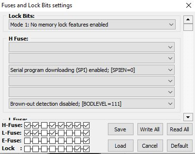
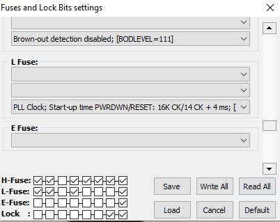
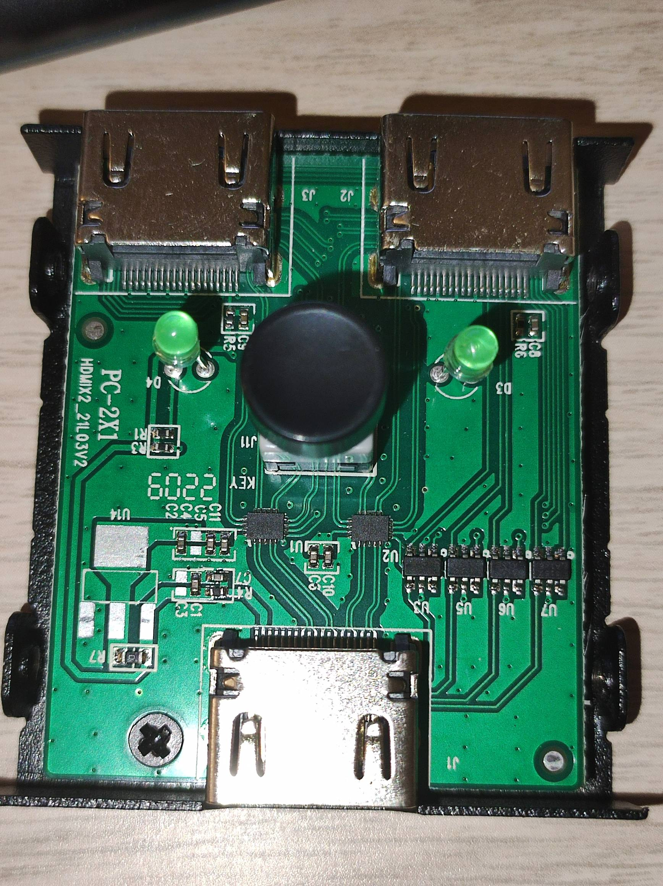
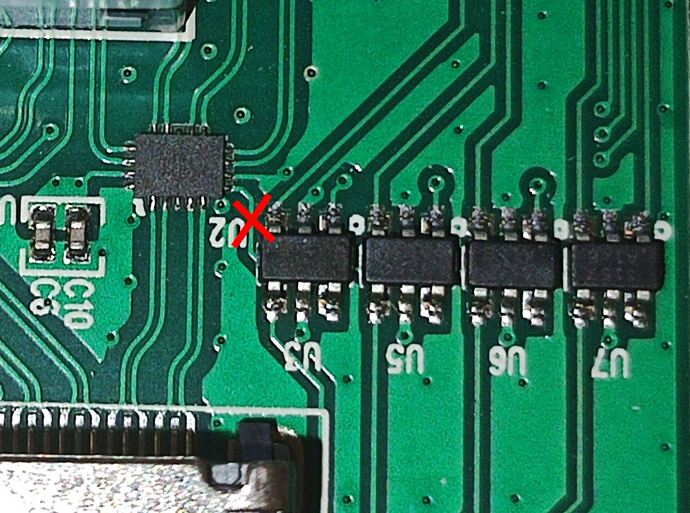
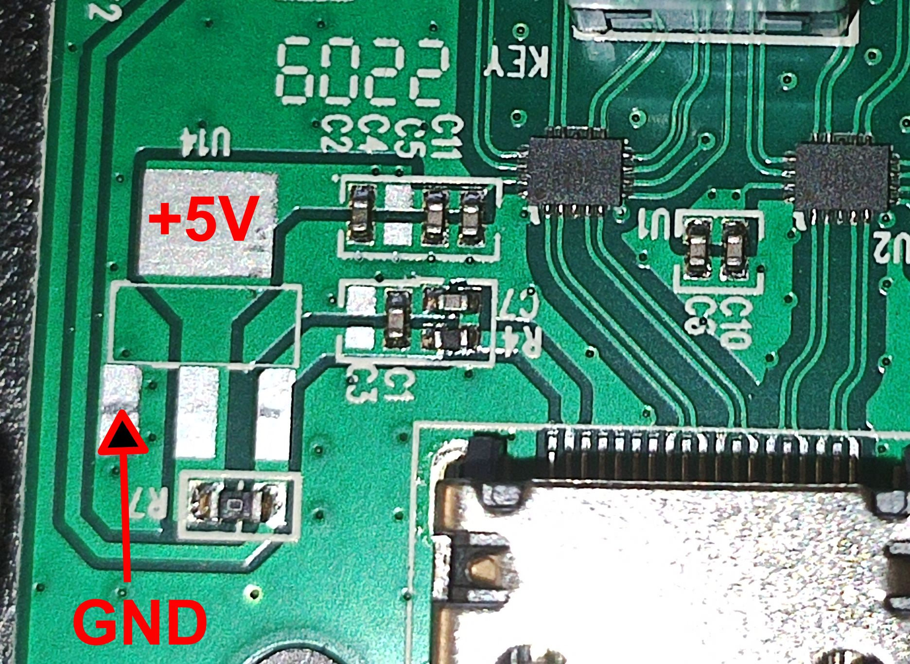
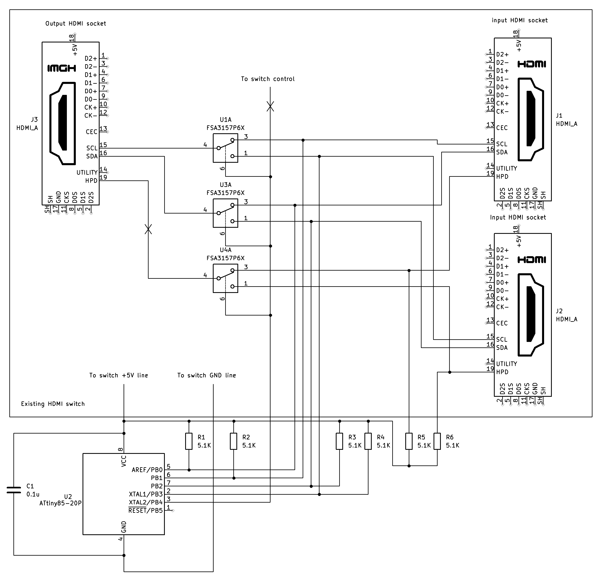
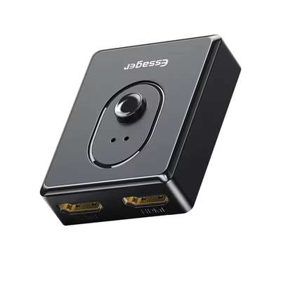
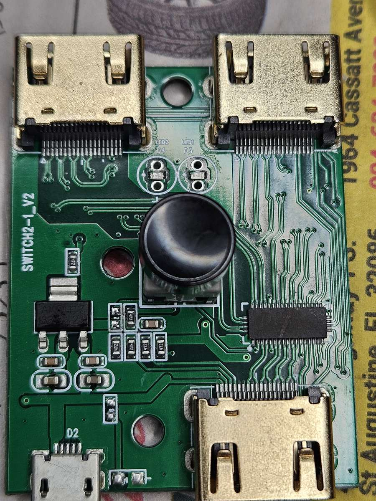
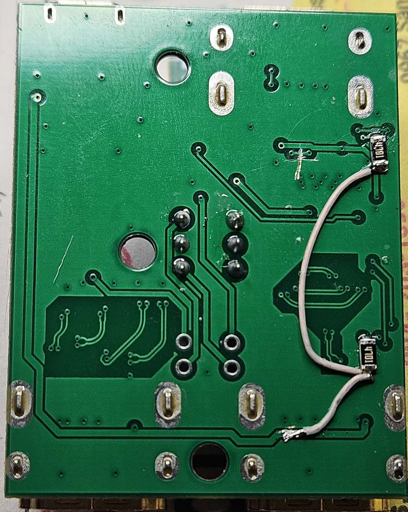
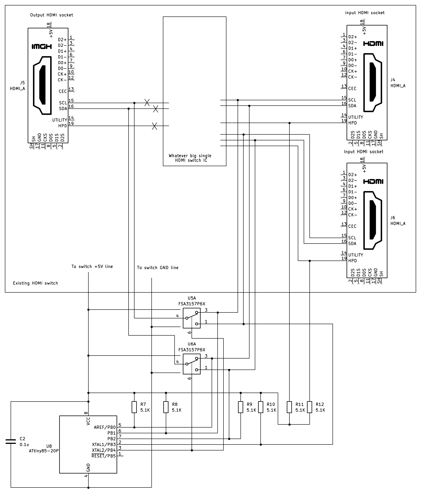

# I2C / DDC 2-Channel Switch

## Description

Many existing KVM switches, especially inexpensive models, lack DDC (Display Data Channel) emulation. Furthermore, simple KVM switches often use general-purpose HDMI/DVI analog switch chips, which physically disconnect the monitor from the computer. This can cause desktop icons to rearrange and increases the time it takes to switch between monitors. While more sophisticated KVM switches may offer EDID (Extended Display Identification Data) emulation, they often do not provide full DDC support. There are also some open-source EDID emulation solutions, but they are not always 100% compatible with the DDC standard.

This project offers a simple solution for switching one monitor between two computers without any emulation. It relies solely on the I2C protocol, which is the foundation of DDC.

It is not clear if all video cards fully adhere to the I2C specification. Therefore, it is advisable to take precautions when using this switch, such as avoiding changing monitor settings from both computers simultaneously.

## Warnings and Disclaimer

**Any modifications you make are at your own risk. Be aware that these changes could damage or destroy your computers, monitors, KVM switch, and other hardware.**

THE SOFTWARE AND INSTRUCTIONS ARE PROVIDED "AS IS", WITHOUT WARRANTY OF ANY KIND, EXPRESS OR IMPLIED, INCLUDING BUT NOT LIMITED TO THE WARRANTIES OF MERCHANTABILITY, FITNESS FOR A PARTICULAR PURPOSE AND NONINFRINGEMENT. IN NO EVENT SHALL THE AUTHORS OR COPYRIGHT HOLDERS BE LIABLE FOR ANY CLAIM, DAMAGES OR OTHER LIABILITY, WHETHER IN AN ACTION OF CONTRACT, TORT OR OTHERWISE, ARISING FROM, OUT OF OR IN CONNECTION WITH THE SOFTWARE OR THE USE OR OTHER DEALINGS IN THE SOFTWARE.

## DDC / I2C Theory

DDC communication between a computer (video card) and a monitor is infrequent. It typically occurs when the computer starts up and the communication itself takes only 30-50 ms, followed by an idle state. This makes it relatively safe to share one monitor between two computers. The I2C protocol includes a "wait" condition where the SCL (Serial Clock) line is held low to make the master device wait for it to become high.

After detecting a start condition on one of the channels (SDA going from HIGH to LOW while SCL is HIGH), this device switches the analog switches for the SDA (Serial Data) and SCL lines to the active channel. It also sets the SCL line of the other channel to a LOW level to signal that the channel is busy. Once a stop condition (SDA going from LOW to HIGH while SCL is HIGH) is received, the LOW level on the other channel's SCL line is removed.

This project is based on a single ATTiny85 microcontroller running on its internal RC oscillator with PLL at 20 MHz. The ATTiny25 and ATTiny45 are also compatible. While a discrete logic implementation would eliminate processing delays, it would require approximately 3-4 chips, making the footprint larger than a single ATTiny85.

### Pros

*   Provides a physical connection from the PC to the monitor, making it impossible to detect that a KVM switch is being used.
*   Requires only a single ATTiny85 and a few pull-up resistors.
*   Allows two computers to have full access to the monitor's DDC/I2C lines for both EDID and DDC control.
*   Implemented for two computers (input channels), but can be scaled to support more with additional work and a suitable chip.

### Cons

*   Requires modifying existing KVM hardware, which involves precise soldering due to the fine pitch of the components.
*   It is not certain that all video cards fully implement the I2C specification of checking for a high SCL line before starting a transmission.
*   Modern monitors can use I2C frequencies up to 100 kHz. Running the ATTiny85 at 20 MHz might cause issues with detecting the proper state. However, in the author's experience, a Windows PC and a Mac connected to the same monitor had no issues, even when simultaneously reading DDC data.
*   This solution will only work with DVI, HDMI, and VGA switches. DisplayPort uses different hardware and is not compatible.

## Programming

Use the compiled [file](Hex/i2c_switch.hex) or compile the code yourself and flash the ATTiny.

The fuses should be set as follows:

## Hardware

This project can be used with any existing 2-channel HDMI/DVI/VGA switch. In most cases, you will need to add your own DDC analog switches. A good option is the TS5A23157 chip, for which many modules are available on AliExpress. The author found a particularly interesting 2-way HDMI switch in a metal case on AliExpress:

It must be in a metal case, which you can recognize by the four screws on the sides. [Example](https://www.aliexpress.com/item/3256804443148398.html)

**WARNING!** Unfortunately, this type of switch seems to be no longer available. The author recently tried to purchase a few from different sellers, but they now have "4K" and "3D" labels on them. These newer versions have a single IC, which would require additional switches. Therefore, purchase this type of switch at your own risk.

The most interesting part for us is that it has separate 2-way analog switches (STG3157) for the HPD, SDA, SCL, and CEC lines (U7, U6, U5, and U3, respectively), and unknown HDMI data switches, which we do not need to worry about. This allows us to use only the ATTiny85 switch without any extra chips:

To integrate this project into the switch, you need to:

1.  Find the PCB track going to the 6th pin of all STG3157 chips and cut it. It is located here:

	
	
2.  Add 3-9 kOhm pull-up resistors to pins 1 and 3 of U7 (HPD line) and connect them to the +5V line (see below).
3.  Connect:
    *   U6 pin 1 to pin 7 of the ATTiny85 (SDA2)
    *   U6 pin 3 to pin 5 of the ATTiny85 (SDA1)
    *   U5 pin 1 to pin 2 of the ATTiny85 (SCL2)
    *   U5 pin 3 to pin 6 of the ATTiny85 (SCL1)
    *   Pin 6 (IN) of any of U3, U5-U7 to pin 3 of the ATTiny85
4.  All SDA and SCL pins (2, 5-7) of the ATTiny85 should be pulled up to the +5V line with 5-10 kOhm resistors.
5.  Add a 0.1 uF capacitor between pins 4 and 8 of the ATTiny85.
6.  Connect the 4th pin of the ATTiny85 to GND and the 8th pin to the +5V lines of the KVM switch:

	

Overall, if your HDMI switch has separate DDC analog switch ICs, the example schematics would look something like this (component references are arbitrary):

And that's it.

Another successful implementation was with an Essager HDMI switch. It is still available on AliExpress, for example, at this [link](https://www.aliexpress.us/item/2255800942906591.html).

There are still a bunch of them available. They look like this:

This switch has a PI3WVR12412 integrated HDMI switch IC, but the great part is that the I2C line control is independent of the video lines, so it is still possible to use the ATTiny without extra switches.

The original PCB for this switch is:

You will need to cut the track that goes to pin 5 of the main IC (DDC control). Add I2C pull-up resistors to the input SDA (pin 13) and SCL (pin 14) of the main IC (the author did this on the back side of the PCB):

After that, put the ATTiny in a DIP package with an IC socket, where all other components are soldered directly to the socket pins and connected to the switch PCB with thin insulated wires:

If you have your own KVM switch, you will need to figure it out on your own. But the general approach is:

*   If there are separate analog switches for the SDA and SCL lines, use them. Just make sure that the SDA1 (pin 5) and SCL1 (pin 6) lines of the ATTiny85 are connected to inputs that are active with a LOW level on the IN pin, and the SDA2 (pin 7) and SCL2 (pin 2) lines of the ATTiny85 are connected to inputs that are active with a HIGH level on the IN pin. Connect pin 3 of the ATTiny85 to the IN input of the switches. Make sure HPD, SDA, and SCL are pulled up to +5V.
*   If there is an HDMI switch with integrated SDA and SCL switches (most KVM switches on the market):
    *   Cut the SDA and SCL lines from all HDMI connectors.
    *   Use external analog switches for it (TS5A23157 modules, for example).
    *   Connect the external switch as in the example above: inputs to the PC connectors, and outputs to the monitor connector.
    *   Do not forget to pull up HPD, SDA, and SCL to +5V. The HPD and CEC lines do not need to be cut.
    *   Find the GND and +5V power lines in your KVM switch and power the ATTiny85 on pins 4 and 8, respectively. Do not forget to wire the power to the switch IC as well.

If external switch ICs are needed, the schematics would be something like this:

