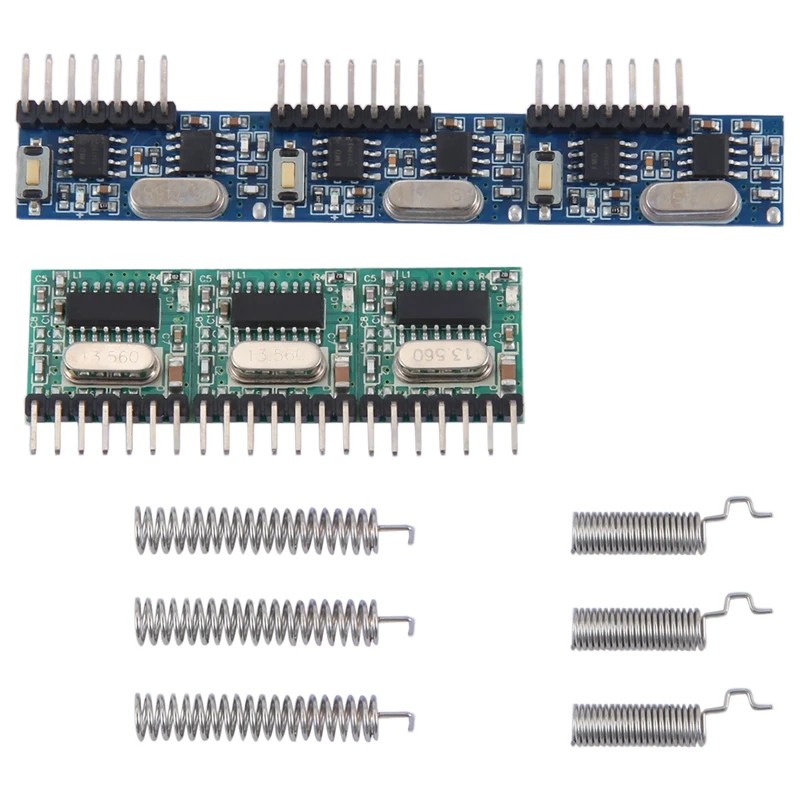

# Enhanced Video Switch Modifications for Custom KVM Setups

## Overview

This project provides detailed guides and implementations for modifying commercially available video switches. The primary goal is to create a synchronized, multi-monitor KVM (Keyboard, Video, Mouse) setup that prevents common issues like desktop rearrangement upon switching, all while minimizing cable clutter.

## Core Objectives

The author's requirements for this custom solution were:
- Utilize existing, readily available video switches.
- Synchronize two or more monitors to switch simultaneously between computers.
- Prevent computers from detecting a monitor disconnect, which would otherwise cause desktop icons and windows to rearrange.
- Maintain a clean setup with a minimal number of cables.

---

## The Challenge of Synchronized, Seamless Switching

### 1. Preventing Monitor Disconnection (The EDID/DDC Problem)

A major issue with simple video switches is that they physically disconnect the video signal lines (including the Display Data Channel, or DDC) from the inactive computer. The operating system detects this as the monitor being unplugged, leading to a time-consuming rearrangement of the desktop.

While some switches offer EDID (Extended Display Identification Data) emulation to combat this, these features can be unreliable or incomplete. This project introduces a more robust solution: **DDC/I2C bus sharing**.

Instead of emulating the monitor's data, this method intelligently shares the monitor's actual DDC/I2C lines between the two computers. An ATTiny85 microcontroller detects communication on one channel, grants it full access to the monitor, and signals to the other computer that the bus is busy. This ensures the inactive PC still sees the monitor as connected.

For a deep dive into the theory, hardware, and firmware, see the [I2C/DDC 2-Channel Switch project](i2c_switch/).

### 2. Synchronizing Multiple Monitors

To switch multiple monitors at the same time, a remote control solution is needed. While a wired connection between switches is possible, it adds to cable clutter. A more elegant solution is to use wireless RF (Radio Frequency) switches. A single transmitter can be paired with multiple receivers, allowing all video switches to be triggered by a single button press. The short distance between devices in a typical desk setup ensures reliable operation.

A recommended ready-to-use RF solution is this transmitter/receiver pair:

[Find it on AliExpress](https://www.aliexpress.us/item/3256807782785576.html)

The receiver can be set to a "latched" mode, meaning it maintains its state after the control signal is sent, perfectly emulating a push-button switch.

---

## Hardware Implementation Examples

Here are two examples of successful modifications on popular HDMI switches.

### Noname 2-Way HDMI Switch (Metal Case)

**Warning:** This specific model appears to be discontinued. Newer versions labeled "4K" or "3D" use a different internal design that is not directly compatible with this guide and would require additional components. Purchase at your own risk.

**Modifications:**
1.  **EDID/DDC Sharing:** The [I2C/DDC switch circuit](i2c_switch/) was integrated into the switch's existing hardware.
2.  **RF Control:** An RF receiver was added to control the switch wirelessly.

The completed assembly combines both modifications for a seamless experience.

The RF receiver is secured inside the metal housing. Care must be taken to insulate the receiver's PCB and ensure its antenna does not touch the metal case, which would block the signal.

### Essager 2-Way HDMI Switch

This switch was modified similarly.

**Modifications:**
1.  **EDID/DDC Sharing:** The [I2C/DDC switch circuit](i2c_switch/) was added.
2.  **RF Control:** An RF receiver was installed. Since this switch has a plastic case, installation is simpler as there are no signal interference concerns.

**Completed Assemblies:**

The final product is a compact, wirelessly controlled switch that keeps both connected PCs happy.

---

## Disclaimer

**Any modifications you make are at your own risk. Be aware that these changes could damage or destroy your computers, monitors, KVM switch, and other hardware.**

THE SOFTWARE AND INSTRUCTIONS ARE PROVIDED "AS IS", WITHOUT WARRANTY OF ANY KIND, EXPRESS OR IMPLIED, INCLUDING BUT NOT LIMITED TO THE WARRANTIES OF MERCHANTABILITY, FITNESS FOR A PARTICULAR PURPOSE AND NONINFRINGEMENT. IN NO EVENT SHALL THE AUTHORS OR COPYRIGHT HOLDERS BE LIABLE FOR ANY CLAIM, DAMAGES OR OTHER LIABILITY, WHETHER IN AN ACTION OF CONTRACT, TORT OR OTHERWISE, ARISING FROM, OUT OF OR IN CONNECTION WITH THE SOFTWARE OR THE USE OR OTHER DEALINGS IN THE SOFTWARE.
